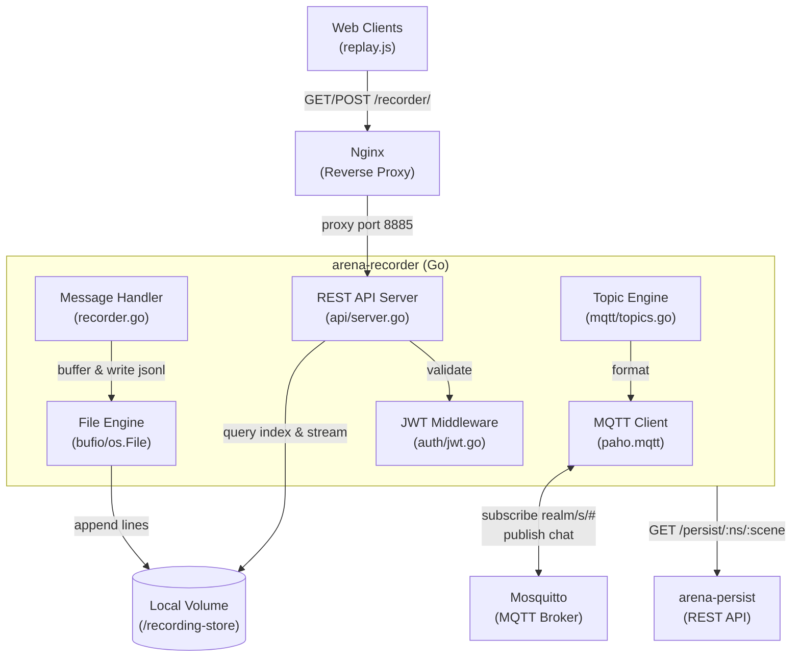
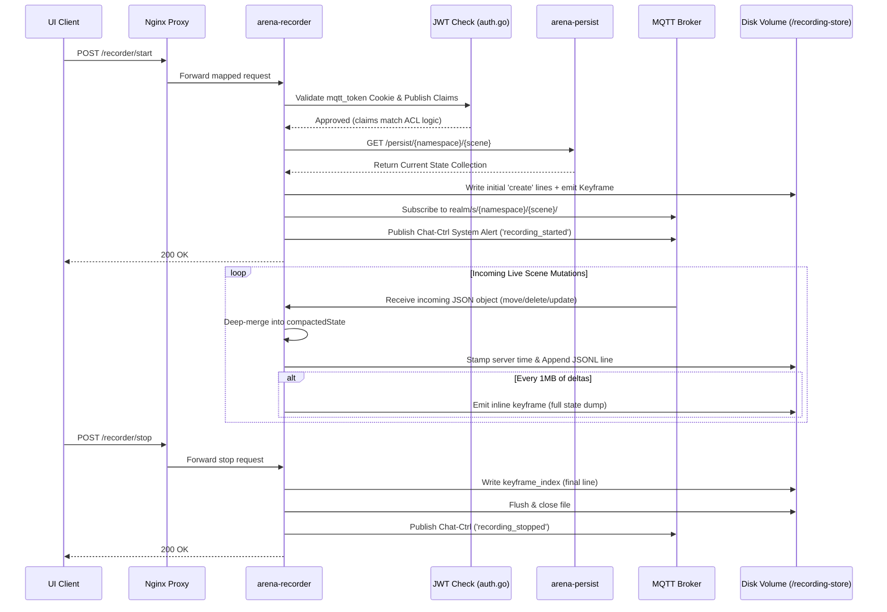

# ARENA Recorder — Requirements & Architecture

> **Purpose**: Machine- and human-readable reference for the ARENA recorder service's features, architecture, and source layout.

## Architecture



## Source File Index

| File | Role | Key Symbols |
|------|------|-------------|
| [main.go](main.go) | Main entry: initialize MQTT client and start REST API server | `main` |
| [api/server.go](api/server.go) | Express-style HTTP REST API handlers with JWT validation | `StartServer`, `startRecordingHandler`, `stopRecordingHandler`, `listRecordingsHandler`, `recordingStatusHandler`, `serveRecordingFileHandler` |
| [auth/jwt.go](auth/jwt.go) | JWT parsing middleware and ACL (Access Control List) routing rules | `ValidateMQTTToken`, `MatchTopic`, `HasSubRight`, `HasPublRight`, `CanRecordScene` |
| [mqtt/recorder.go](mqtt/recorder.go) | Core engine: MQTT connection, buffered stream capture, keyframing, file system teardown | `Init`, `StartRecording`, `captureInitialState`, `StopRecording`, `IsRecording`, `deepMerge`, `emitKeyframeLocked` |
| [mqtt/repair.go](mqtt/repair.go) | Offline repair: scans `.jsonl` files and reconstructs missing `keyframe_index` | `RepairIndex`, `RepairAllRecordings`, `HasKeyframeIndex` |
| [mqtt/recorder_test.go](mqtt/recorder_test.go) | Unit tests for deep merge, state tracking, keyframe emission, and index repair | `TestDeepMerge_*`, `TestStateTracking_*`, `TestKeyframeEmission_*`, `TestRepairIndex_*` |
| [mqtt/topics.go](mqtt/topics.go) | Pre-defined graph matching logic translating physical scene spaces into Mosquitto string subscriptions | `Topics`, `FormatTopic` |

## Feature Requirements

### Authentication & API Security

| ID | Requirement | Source |
|----|-------------|--------|
| REQ-REC-001 | Route protected endpoints through Nginx `location ^~ /recorder/` proxy injection | `docker-compose.yaml` |
| REQ-REC-002 | Extract and parse the `mqtt_token` cookie via standard HTTP library | [auth/jwt.go#ValidateMQTTToken](auth/jwt.go) |
| REQ-REC-003 | Enforce strict RSA signature validation using `jwt.public.pem` exactly mirroring Account service | [auth/jwt.go#ValidateMQTTToken](auth/jwt.go) |
| REQ-REC-004 | Start/Stop operations require publish (`publ`) rights to `realm/s/<namespace>/<sceneId>/#` | [api/server.go#startRecordingHandler](api/server.go) |
| REQ-REC-005 | Querying/Listing/Streaming require subscribe (`subl`) rights to the requested recording topic structure | [api/server.go#listRecordingsHandler](api/server.go) |

### Ingestion Logic & Time-series Generation

| ID | Requirement | Source |
|----|-------------|--------|
| REQ-REC-010 | The service establishes an independent identity inside Mosquitto using local `config.json` Service Token credentials | [mqtt/recorder.go#Init](mqtt/recorder.go) |
| REQ-REC-011 | Starting a recording mandates querying `arena-persist` for the absolute known reality at time $t=0$ | [mqtt/recorder.go#captureInitialState](mqtt/recorder.go) |
| REQ-REC-012 | Transform MongoDB schema payloads from `persist` payload responses into `action: create` format injected natively into the recording | [mqtt/recorder.go#captureInitialState](mqtt/recorder.go) |
| REQ-REC-013 | Bind Goroutines to `realm/s/<namespace>/<sceneId>/#` explicitly per requested session without bleeding across active processes | [mqtt/recorder.go#StartRecording](mqtt/recorder.go) |
| REQ-REC-014 | Guarantee rapidly mutating updates enforce a single direction stream loop: dynamically injecting a `timestamp: <RFC3339Nano>` value into the JSON body to maintain absolute sequence without trusting raw physical client device time drifts | [mqtt/recorder.go#handler](mqtt/recorder.go) |
| REQ-REC-015 | Publish physical Chat-Ctrl broadcast flags via topic formatting alerting connected editors of `recording_started` and `recording_stopped` statuses | [mqtt/recorder.go#StartRecording](mqtt/recorder.go) |

### Local File System Stability

| ID | Requirement | Source |
|----|-------------|--------|
| REQ-REC-020 | Payload outputs (`.jsonl`) target isolated physical non-ephemeral directory mappings (`/recording-store`) enforcing isolation | [mqtt/recorder.go#StartRecording](mqtt/recorder.go) |
| REQ-REC-021 | The service avoids raw byte array arrays in memory over time (OOM kills) by writing payloads to disk as chunked streaming line appends directly. Note: the keyframing system maintains a `compactedState` map in memory proportional to the number of *active* objects (not total messages), which is bounded and acceptable. | [mqtt/recorder.go#handler](mqtt/recorder.go) |

### Keyframing (I-frames)

| ID | Requirement | Source |
|----|-------------|--------|
| REQ-REC-030 | The recorder maintains a compacted state map (`compactedState`) in memory during recording, keyed by `object_id`. `create`/`update` actions are deep-merged (recursive map merge preserving nested structures); `delete` actions remove the object. Messages without `object_id` are written but do not affect state. | [mqtt/recorder.go#writeLine](mqtt/recorder.go) |
| REQ-REC-031 | A keyframe is emitted as an inline JSONL line (`"action": "keyframe"`) every 1 MB of delta data written. The keyframe contains the full compacted state of all active objects at that point in time. An initial keyframe is emitted immediately after `captureInitialState`. | [mqtt/recorder.go#emitKeyframeLocked](mqtt/recorder.go) |
| REQ-REC-032 | A `keyframe_index` line is written as the final line of the `.jsonl` file during `StopRecording`. It contains an array of `IndexEntry` objects, each with `timestamp` (RFC3339Nano), `offset` (byte offset from start of file), and `length` (byte length of the keyframe JSON line, excluding newline). | [mqtt/recorder.go#StopRecording](mqtt/recorder.go) |
| REQ-REC-033 | If a recording terminates without writing the `keyframe_index` (crash, kill), the inline keyframes remain intact in the stream. The `RepairIndex` function can scan the file and reconstruct the index. The CLI exposes this as `./arena-recorder repair [file]`. | [mqtt/repair.go#RepairIndex](mqtt/repair.go) |
| REQ-REC-034 | The `RepairIndex` operation is idempotent: running it on a file that already has a `keyframe_index` is a no-op. | [mqtt/repair.go#RepairIndex](mqtt/repair.go) |

## Recording File Format Specification

### Structure

A `.jsonl` recording file consists of three types of lines, all valid JSON:

1. **Delta messages** — standard scene object mutations (the bulk of the file):
   ```json
   {"object_id":"cube1","action":"create","timestamp":"2026-01-01T00:00:00.000Z","data":{"position":{"x":0,"y":0,"z":0}}}
   {"object_id":"cube1","action":"update","timestamp":"2026-01-01T00:00:01.000Z","data":{"position":{"y":5}}}
   {"object_id":"cube1","action":"delete","timestamp":"2026-01-01T00:00:02.000Z"}
   ```

2. **Keyframe lines** — periodic full state snapshots interspersed in the stream:
   ```json
   {"action":"keyframe","timestamp":"2026-01-01T00:00:10.000Z","state":{"cube1":{"object_id":"cube1","action":"create","data":{"position":{"x":0,"y":5,"z":0}}},"sphere2":{...}}}
   ```
   The `state` field is a map of `object_id → compacted object state` representing every active object at that instant. The compacted state is the result of deep-merging all prior `create`/`update` messages for that object and removing any `delete`d objects.

3. **Keyframe index** — the last line of a cleanly-closed recording:
   ```json
   {"action":"keyframe_index","index":[{"timestamp":"2026-01-01T00:00:00.000Z","offset":0,"length":4523},{"timestamp":"2026-01-01T00:00:10.000Z","offset":2097152,"length":4891}]}
   ```

### Deep Merge Semantics

When an `update` message is applied to an object's state:
- **Map values** are recursively merged (e.g., updating `position.y` preserves `position.x` and `position.z`).
- **Arrays and primitive values** are overwritten entirely.
- **New keys** are added.
- This matches JavaScript's behavior of `Object.assign` applied recursively on nested objects.

## Playback Implementation Reference

> This section defines the contract that any playback client (e.g., `replay.js` in the browser) **must** implement to correctly seek through keyframed recordings.

### Loading a Recording

1. **Fetch the file** via `GET /recorder/files/<filename>.jsonl`. The server supports HTTP `Range` requests.

2. **Read the keyframe index**: Fetch the last ~4 KB of the file (`Range: bytes=-4096`) and parse the final line. If it has `"action": "keyframe_index"`, parse the `index` array into a list of `{timestamp, offset, length}` entries. The timestamps are monotonically increasing.

3. **Fallback if no index**: If the last line is not a `keyframe_index` (recording was not cleanly stopped), fall back to one of:
   - Request the server run `./arena-recorder repair <file>` then retry, OR
   - Stream the entire file linearly and scan for `"action": "keyframe"` lines client-side.

### Seeking to Time T

1. **Binary search** the index array for the latest entry where `timestamp <= T`.

2. **Fetch the keyframe** using a precise HTTP Range request:
   ```
   Range: bytes=<offset>-<offset + length - 1>
   ```
   Parse the returned JSON. The `state` field is the complete scene state at that keyframe's timestamp.

3. **Instantiate the scene** from the keyframe's `state` map. Each value is a fully compacted object — apply them as `create` operations.

4. **Apply deltas** from the keyframe to `T`: Fetch the byte range from `offset + length` to the next keyframe's offset (or end of file if it's the last keyframe), parse each JSONL line, and apply only those with `timestamp <= T`:
   - `"action": "create"` → create the object (or deep-merge if it already exists from the keyframe)
   - `"action": "update"` → deep-merge into the existing object
   - `"action": "delete"` → remove the object
   - `"action": "keyframe"` → skip (these are interleaved but not needed when reading sequentially forward)

### Forward Playback

During normal forward playback from the current position, simply read lines sequentially and apply delta messages in order. Keyframe lines encountered during forward playback can be skipped.

### Memory Considerations

The player should maintain a single `state: Map<string, object>` representing the current scene. On seek, this map is replaced entirely by the keyframe state. This avoids accumulating stale objects from previous seeks.

## Recorder Sequence Flow



## Planned / Future Development

- **Manual Time-lapse Construction API:** We require the architecture to support generating composite `.jsonl` recordings entirely offline without an active live session. For example, injecting a weekly "splat scan" of a construction project across a year at distinct synthetic timestamps to form an accurate time-lapse. This would require an API/tooling suite to programmatically merge multiple discrete asset dumps onto an arbitrary timeline, allowing `arena-web-core`'s replay scrubber to cycle through long-term physical site topologies natively.
- **Multiplayer Watch Parties:** Currently `arena-recorder` enforces localized file streaming mapping heavily optimizing client-side scrubber parsing performance via `replay.js`. Expanding on this architecture for multiplayer watch party viewing involves flipping the `Go` timeline pump: using `arena-recorder` as the central loop dynamically blasting historic parsed events onto ephemeral network proxies like `realm/s/<namespace>/replay-<uuid>` securely. This was deferred due to strict backend constraints requiring real-time ACL Mosquitto validation proxying.
- **Recording Lifecycle and Storage Management:** Active recordings can rapidly consume storage space. We require the implementation of manual deletion endpoints in the API (and paired UI buttons) to let users prune obsolete runs. Additionally, a recurring cron-job worker must be introduced to automatically monitor and purge old/orphaned recordings based on maximum disk capacity constraints or an explicit age-based Time-to-Live (TTL) expiration strategy.
- **Jitsi Recorder Service Integration:** Integrate with the Jitsi recorder service to enable replaying 3D video conference meetings, using canvases for class recording, and creating instructional ARENA videos.
- Scene snapshot / versioning integration matching persist definitions.
