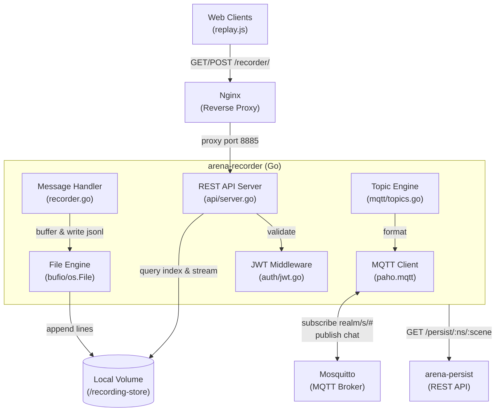
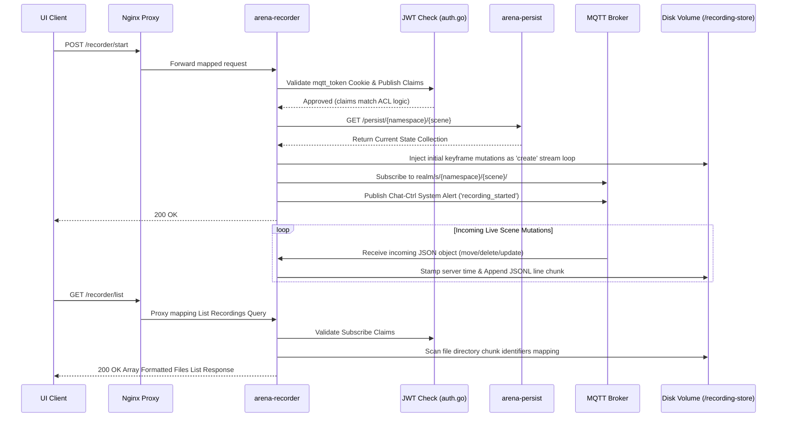

# ARENA Recorder — Requirements & Architecture

> **Purpose**: Machine- and human-readable reference for the ARENA recorder service's features, architecture, and source layout.

## Architecture

## Source File Index

| File | Role | Key Symbols |
|------|------|-------------|
| [main.go](main.go) | Main entry: initialize MQTT client and start REST API server | `main` |
| [api/server.go](api/server.go) | Express-style HTTP REST API handlers with JWT validation | `StartServer`, `startRecordingHandler`, `stopRecordingHandler`, `listRecordingsHandler`, `recordingStatusHandler`, `serveRecordingFileHandler` |
| [auth/jwt.go](auth/jwt.go) | JWT parsing middleware and ACL (Access Control List) routing rules | `ValidateMQTTToken`, `MatchTopic`, `HasSubRight`, `HasPublRight`, `CanRecordScene` |
| [mqtt/recorder.go](mqtt/recorder.go) | Core engine: MQTT connection, buffered stream capture, file system teardown | `Init`, `StartRecording`, `captureInitialState`, `StopRecording`, `IsRecording` |
| [mqtt/topics.go](mqtt/topics.go) | Pre-defined graph matching logic translating physical scene spaces into Mosquitto string subscriptions | `Topics`, `FormatTopic` |

## Feature Requirements

### Authentication & API Security

| ID | Requirement | Source |
|----|-------------|--------|
| REQ-REC-001 | Route protected endpoints through Nginx `location ^~ /recorder/` proxy injection | `docker-compose.yaml` |
| REQ-REC-002 | Extract and parse the `mqtt_token` cookie via standard HTTP library | [auth/jwt.go#ValidateMQTTToken](auth/jwt.go) |
| REQ-REC-003 | Enforce strict RSA signature validation using `jwt.public.pem` exactly mirroring Account service | [auth/jwt.go#ValidateMQTTToken](auth/jwt.go) |
| REQ-REC-004 | Start/Stop operations require publish (`publ`) rights to `realm/s/<namespace>/<sceneId>/#` | [api/server.go#startRecordingHandler](api/server.go) |
| REQ-REC-005 | Querying/Listing/Streaming require subscribe (`subl`) rights to the requested recording topic structure | [api/server.go#listRecordingsHandler](api/server.go) |

### Ingestion Logic & Time-series Generation

| ID | Requirement | Source |
|----|-------------|--------|
| REQ-REC-010 | The service establishes an independent identity inside Mosquitto using local `config.json` Service Token credentials | [mqtt/recorder.go#Init](mqtt/recorder.go) |
| REQ-REC-011 | Starting a recording mandates querying `arena-persist` for the absolute known reality at time $t=0$ | [mqtt/recorder.go#captureInitialState](mqtt/recorder.go) |
| REQ-REC-012 | Transform MongoDB schema payloads from `persist` payload responses into `action: create` format injected natively into the recording | [mqtt/recorder.go#captureInitialState](mqtt/recorder.go) |
| REQ-REC-013 | Bind Goroutines to `realm/s/<namespace>/<sceneId>/#` explicitly per requested session without bleeding across active processes | [mqtt/recorder.go#StartRecording](mqtt/recorder.go) |
| REQ-REC-014 | Guarantee rapidly mutating updates enforce a single direction stream loop: dynamically injecting a `timestamp: <RFC3339Nano>` value into the JSON body to maintain absolute sequence without trusting raw physical client device time drifts | [mqtt/recorder.go#handler](mqtt/recorder.go) |
| REQ-REC-015 | Publish physical Chat-Ctrl broadcast flags via topic formatting alerting connected editors of `recording_started` and `recording_stopped` statuses | [mqtt/recorder.go#StartRecording](mqtt/recorder.go) |

### Local File System Stability

| ID | Requirement | Source |
|----|-------------|--------|
| REQ-REC-020 | Payload outputs (`.jsonl`) target isolated physical non-ephemeral directory mappings (`/recording-store`) enforcing isolation | [mqtt/recorder.go#StartRecording](mqtt/recorder.go) |
| REQ-REC-021 | The service avoids raw byte array arrays in memory over time (OOM kills) by writing payloads to disk as chunked streaming line appends directly | [mqtt/recorder.go#handler](mqtt/recorder.go) |

## Recorder Sequence Flow

## Architecture Constraints & Code Maintenance Instructions
- **Separation of Concerns:** The recorder MUST NOT mutate any live database records in `arena-persist`. It strictly consumes `arena-persist` via standard REST/GraphQL queries to bootstrap $t=0$ keyframes.
- **File System Usage:** Writing `.jsonl` payloads MUST be buffered (e.g. using `bufio`). Avoid accumulating large 3D scene mutations entirely in memory to prevent Docker container OOM kills.
- **ACL Integrity:** Maintain the JWT middleware located in `auth/jwt.go`. The recorder is exposed externally through the Nginx proxy; all `/recorder/start` calls must strictly validate the cookie `mqtt_token` and verify the user has publish/manage rights for the requested scene namespace.
- **Goroutine Leakage:** Always verify that every started goroutine for recording has a deterministic exit condition (e.g. context cancellation, timeout, or explicit `/recorder/stop` signal).
- **Dependencies:** Attempt to stick to the Go standard library (`net/http`, `encoding/json`, `bufio`, `crypto/rsa`) where possible. Only augment `go.mod` if strictly necessary to avoid supply chain bloat.

## Planned / Future Development

- **Multiplayer Watch Parties:** Currently `arena-recorder` enforces localized file streaming mapping heavily optimizing client-side scrubber parsing performance via `replay.js`. Expanding on this architecture for multiplayer watch party viewing involves flipping the `Go` timeline pump: using `arena-recorder` as the central loop dynamically blasting historic parsed events onto ephemeral network proxies like `realm/s/<namespace>/replay-<uuid>` securely. This was deferred due to strict backend constraints requiring real-time ACL Mosquitto validation proxying.
- Auto-TTL cleanup logic preventing total disk bloat.
- Scene snapshot / versioning integration matching persist definitions.
